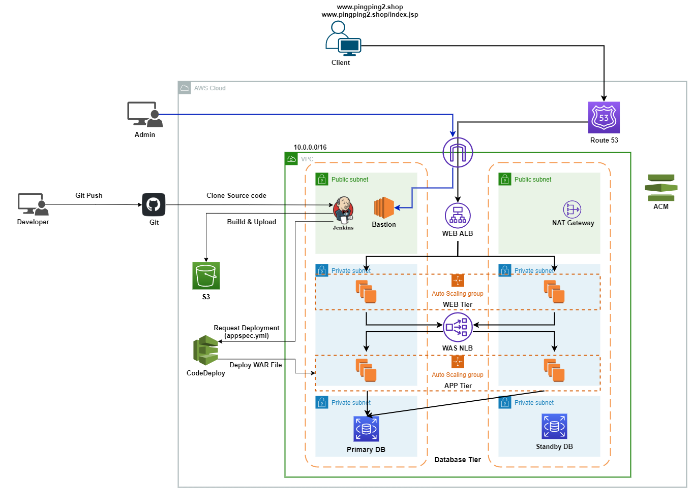

# terraform
terraform study repository

<br>

Terraform 3 Tier architecture & Packer AMI Automation

<br>

## Structures
```
❯ tree | grep -v tfstate
.
├── README.md
├── modules
│   ├── ec2
│   │   ├── README.md
│   │   ├── main.tf
│   │   ├── outputs.tf
│   │   ├── variables.tf
│   │   └── version.tf
│   ├── lb
│   │   ├── main.tf
│   │   ├── output.tf
│   │   ├── provider.tf
│   │   └── variables.tf
│   ├── rds
│   │   ├── mysql
│   │   │   ├── README.md
│   │   │   ├── data.tf
│   │   │   ├── main.tf
│   │   │   ├── output.tf
│   │   │   ├── provider.tf
│   │   │   ├── test_vars
│   │   │   │   └── test.tfvars
│   │   │   └── variables.tf
│   │   └── postgresql
│   └── vpc
│       ├── README.md
│       ├── main.tf
│       ├── output.tf
│       ├── provider.tf
│       └── variables.tf
└── project
    ├── 3Tier
    │   ├── asg.tf
    │   ├── asg_policy.tf
    │   ├── data.tf
    │   ├── ec2.tf
    │   ├── ec2_security_group.tf
    │   ├── env
    │   │   └── test.tfvars
    │   ├── outputs.tf
    │   ├── provider.tf
    │   ├── rds.tf
    │   ├── scripts
    │   │   ├── common
    │   │   │   ├── amz2_init.sh
    │   │   │   └── jenkins_install.sh
    │   │   ├── was
    │   │   │   ├── setenv.sh
    │   │   │   ├── shutdown.sh
    │   │   │   ├── startup.sh
    │   │   │   ├── tomcat.service
    │   │   │   ├── tomcat_install.sh
    │   │   │   └── was_userdata.sh
    │   │   └── web
    │   │       └── nginx_tomcat.tftpl
    │   ├── variables.tf
    │   ├── vpc.tf
    │   ├── was-nlb.tf
    │   └── web-alb.tf
    ├── common
    │   ├── acm
    │   │   ├── data.tf
    │   │   ├── main.tf
    │   │   ├── output.tf
    │   │   ├── provider.tf
    │   │   └── variables.tf
    │   ├── etc
    │   │   ├── backend.tf
    │   │   ├── provider.tf
    │   │   ├── s3.tf
    │   │   └── variables.tf
    │   ├── iam
    │   │   ├── data.tf
    │   │   ├── main.tf
    │   │   ├── provider.tf
    │   │   └── variables.tf
    │   └── route53
    │       ├── main.tf
    │       ├── provider.tf
    │       └── variables.tf
    ├── packer
    │   └── was
    │       ├── packer.pkrvars.hcl
    │       ├── tomcat_ami.pkr.hcl
    │       └── tomcat_install.sh
    └── test
        ├── data.tf
        ├── provider.tf
        └── variables.tf

24 directories, 74 files
```

## What i did
<br>

* 3 Tier Architecture  



<br><br>

- Common Resources
    - IAM
    - Route 53
    - ACM
    - S3, DynamoDB (For backend tfstate resource)

<br>

- Packer
    - WAS Image Builder

<br>

- Project/3tier
    - VPC, ..
    - EC2
    - Load Balancer
    - ASG
    - Launch Template
    - RDS (MySQL)

## 개선점

- Module화 (postgresql, asg, asg_policy, load balancer, IAM, ..)
- 반복적인 소스 코드 줄이기 (for, count, for_each, ..)
- name_prefix 활용하기 (var.service_name + var.env + var.region)
- 동적으로 인프라 생성 => count에서 ? : 로 if문 활용
- data 섹션에서 tfstate 활용하는 방법 익히기
- pakcer의 Provision 부분에서 Shell Script가 아닌 멱등성을 보장하는 Ansible 활용
    => Ansible Role 활용

<br>

<br>

## Plan

<br>

- 진행 (별도 Blog에 업로드)

1. Jenkins, Code Deploy를 활용한 CI/CD Pipeline
<br>
    - Maven 3.6.3
    - War 파일 Build 후 S3에 Upload 후 CodeDeploy를 활용한 ASG Blue/Green

<br>

- 학습 예정

2. EKS Provisioning

<br>

    - Infra Provision : Terraform
    - Configuration Management & Docker Image Build : Ansible & Packer
    - ALB Ingress Controller
    - External DNS
    - CNI
    - Prometheus & Grafana (Monitoring)
    - EFK, ELK (Logging)
    - Pod IAM Management (Kube2iam, ..)
    - Dashboard
    - Cluster-Autoscaler
    - CI/CD Pipeline